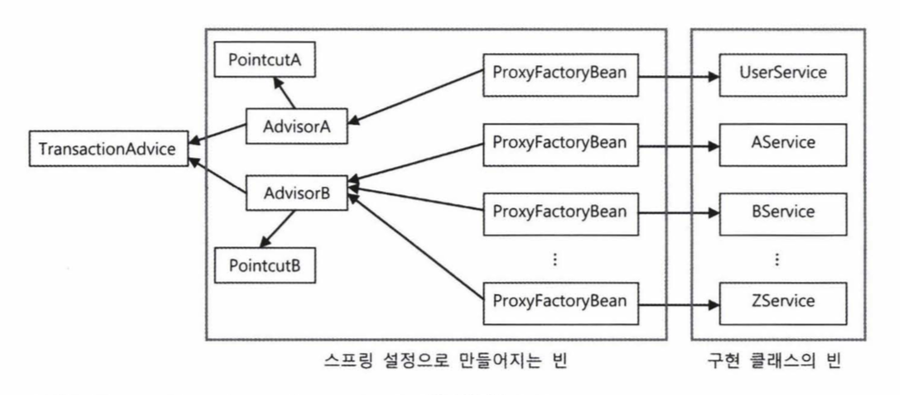

# 6.4 스프링의 프록시 팩토리 빈

## 6.4.1 ProxyFactoryBean

스프링의 ProxyFactoryBean은 프록시를 생성해서 빈 오브젝트로 등록하게 해주는 팩토리 빈이다.
기존의 TxProxyFactoryBean과 차이점은 ProxyFactoryBean은 순수하게 프록시를 생성하는 작업만을 담당하고
프록시를 통해 제공해줄 부가기능은 별도의 빈에 둘 수 있다.

ProxyFactoryBean이 생성하는 프록시에서 사용할 부가기능은 MethodInterceptor 인터페이스를 구현해서 만든다.
MethodInterceptor의 invoke() 메서드는 ProxyFactoryBean으로부터 타깃 오브젝트에 대한 정보까지도 함께 제공받는다.
그래서 타깃 오브젝트에 상관없이 독립적으로 만들어질 수 있다.
따라서 MethodInterceptor 오브젝트는 타깃이 다른 여러 프록시에서 함께 사용할 수 있고, 싱글톤 빈으로 등록 가능하다.

```java
public class DynamicProxyTest {
    @Test
    public void SimpleProxy(){
        Hello proxiedHello = (Hello) Proxy.newProxyInstance(
                getClass().getClassLoader(),
                new Class[]{Hello.class},
                new UppercaseHandler(new HelloTarget())
        );
    }

    @Test
    public void proxyFactoryBean(){
        ProxyFactoryBean pfBean = new ProxyFactoryBean();
        pfBean.setTarget(new HelloTarget());
        pfBean.addAdvice(new UppercaseAdvice());

        Hello proxiedHello = (Hello) pfBean.getObject();

        assertEquals(proxiedHello.sayHello("Toby"), "HELLO TOBY");

    }

    static class UppercaseAdvice implements MethodInterceptor {
        @Override
        public Object invoke(MethodInvocation invocation) throws Throwable {
            String ret = (String) invocation.proceed();
            return ret.toUpperCase();
        }
    }
}

```

### 어드바이스 : 타깃이 필요 없는 순수한 부가기능

UppercaseAdvice 클래스를 보면 타깃 오브젝트가 등장하지 않는다.
MethodInvocation은 타깃 오브젝트의 메서드를 실행할 수 있는 기능이 있기 때문에 부가기능을 제공하는 데만 집중할 수 있다.

MethodInvocation은 일종의 **콜백 오브젝트**로, proceed() 메서드를 실행하면 타깃 오브젝트의 메서드를 내부적으로 실행해주는 기능이 있다.
ProxyFactoryBean은 작은 단위의 템플릿/콜백 구조를 응용해서 적용했기 때문에 템플릿 역할을 하는 MethodInvocation을 싱글톤으로 두고 공유할 수 있다.

#### addAdvice()

addAdvice() 메서드를 통해 여러개의 MethodInterceptor 를 추가할 수 있다.
기존의 프록시 팩토리 빈은 새로운 부가기능을 추가할 때마다 프록시와 프록시 팩토리 빈도 추가해줘야 했다면,
스프링 프록시 팩토리 빈은 addAdvice() 덕분에 다수의 부가기능을 적용하더라도 하나의 ProxyFactoryBean 이면 충분하다.

#### advice 의 정의

MethodInterceptor처럼 타깃 오브젝트에 적용하는 부가기능을 담은 오브젝트를 스프링에서는 **어드바이스**라고 부른다.


ProxyFactoryBean을 적용한 코드를 보면 프록시가 구현해야 하는 Hello 라는 인터페이스를 제공해주는 부분이 없다.
그 이유는 ProxyFactoryBean에 있는 인터페이스 자동검출 기능을 이용해 타깃 오브젝트가 구현하고 있는 인터페이스 정보를 알아내기 때문이다.

그 밖에도 ProxyFactoryBean은 경우에 따라서 CGLib이라고 하는 오픈소스 바이트코드 생성 프레임워크를 이용해 프록시를 만들기도 한다.

### 포인트컷: 부가기능 적용 대상 메서드 선정 방법

기존의 InvocationHandler를 직접 구현했을 때는 메서드의 이름을 가지고 부가기능을 적용 대상 메서드를 선정하는 작업을 직접 해야했다.
이전의 TxProxyFactoryBean은 pattern이라는 메서드 이름 비교용 스트링 값을 DI 받아서 TransactionHandler를 생성할 때 이를 넘겨준다.
그리고 이 핸들러는 요청이 들어오는 메서드의 이름과 패턴을 비교해서 부가기능인 트랜잭션 적용 대상을 판별했다.

하지만 스프링의 ProxyFactoryBean과 MethodInterceptor를 사용하면 이는 불가능하다.
트랜잭션 적용 패턴은 프록시마다 다를 수 있기 때문에 여러 프록시가 공유하는 MethodInterceptor에 특정 프록시에만 적용되는 패턴을 넣으면
문제가 되기 때문이다.

스프링의 ProxyFactoryBean 방식은 두 가지 확장 기능인 부가기능(Advice)와 메서드 선정 알고리즘(Pointcut)을 활용하는 유연한 구조를 제공한다.


- 부가기능을 제공하는 오브젝트를 **어드바이스**라고 부른다.
- 메서드 선정 알고리즘을 담은 오브젝트를 **포인트컷**이라고 부른다.

두 가지 모두 여러 프록시에서 공유가 가능하도록 만들어지기 때문에 스프링의 싱글톤 빈으로 등록이 가능하다.
어드바이스와 포인트컷이 작동되는 순서는 다음과 같다.

1. 프록시가 클라이언트로부터 요청을 받는다.
2. 요청을 받은 프록시는 먼저 포인트컷에게 부가기능을 부여할 메서드인지를 확인해달라고 요청한다.
3. 확인받은 후, 프록시는 MethodInterceptor 타입의 어드바이스를 호출한다.
4. 어드바이스가 부가기능을 부여하는 중에 타깃 메서드의 호출이 필요하면 프록시로부터 전달받은 
MethodInvocation 타입 콜백 오브젝트의 proceed() 메서드를 통해 호출한다.

재사용 가능한 기능을 만들어두고 바뀌는 부분(콜백 오브젝트와 메서드 호출정보)만
외부에서 주입해서 이를 작업 흐름(부가기능 부여) 중에 사용하도록 하는 전형적인 **템플릿/콜백 구조**이다.

어드바이스만 등록할 때는 addAdvice() 메서드만 호출하면 되지만 포인트컷과 함께 사용할 때는 Advisor 타입의 오브젝트에 담아서 조합해야 한다.
포인트컷과 어드바이스를 따로 등록하면 **어떤 어드바이스에 대해 어떤 포인트컷을 적용할지 애매해지기 때문이다.**

> 어드바이저 = 포인트컷 + 어드바이스

## 6.4.2 ProxyFactoryBean 적용

### TransactionAdvice

부가기능을 담당하는 어드바이스는 MethodInterceptor라는 Advice 서브인터페이스를 구현해서 만든다.

```java
public class TransactionAdvice implements MethodInterceptor {
    PlatformTransactionManager transactionManager;

    public void setTransactionManager(PlatformTransactionManager transactionManager) {
        this.transactionManager = transactionManager;
    }

    @Override
    public Object invoke(MethodInvocation invocation) throws Throwable {
        TransactionStatus status = this.transactionManager.getTransaction(new DefaultTransactionDefinition());
        try {
            Object ret = invocation.proceed();
            this.transactionManager.commit(status);
            return ret;
        } catch (RuntimeException e) {
            this.transactionManager.rollback(status);
            throw e;
        }
    }
}
```

### 스프링 XML 설정파일


```xml
<bean id="transactionAdvice" class="service.TransactionAdvice">
    <property name="transactionManager" ref="transactionManager"/>
</bean>

<bean id="transactionPointcut" class="org.springframework.aop.support.NameMatchMethodPointcut">
    <property name="mappedName" value="upgrade*"/>
</bean>

<bean id="transactionAdvisor" class="org.springframework.aop.support.DefaultPointcutAdvisor">
    <property name="advice" ref="transactionAdvice"/>
    <property name="pointcut" ref="transactionPointcut"/>
</bean>
```

차례대로 어드바이스, 포인트컷, 어드바이저 xml 설정 방식이다.
그리고 이 어드바이저의 bean id를 통해 아래와 같이 설정하면 끝이다.
property name의 "interceptorNames"는 어드바이저와 어드바이스를 동시에 설정해줄 수 있는 프로퍼티다.

```xml
<bean id="userService" class="org.springframework.aop.framework.ProxyFactoryBean">
    <property name="target" ref="userServiceImpl"/>
    <property name="interceptorNames">
        <list>
            <value>transactionAdvisor</value>
        </list>
    </property>
</bean>
```

<details>
<summary><b>ProxyFactoryBean을 이용한 트랜잭션 테스트</b></summary>
<div markdown="1">

```java
@Test
@DirtiesContext
public void upgradeAllOrNothing() throws Exception {
    TestUserService testUserService = new TestUserService(users.get(3).getId());
    testUserService.setUserDao(userDao);
    testUserService.setMailSender(mailSender);

    ProxyFactoryBean txProxyFactoryBean =
            context.getBean("&userService", ProxyFactoryBean.class);
    txProxyFactoryBean.setTarget(testUserService);
    UserService txUserService = (UserService) txProxyFactoryBean.getObject();

    userDao.deleteAll();
    for (User user : users) userDao.add(user);

    try {
        txUserService.upgradeLevels();
        fail("TestUserServiceException expected");
    } catch (TestUserServiceException e) {

    }
    checkLevel(users.get(1), false);
}
```

</div>
</details>

### 어드바이스와 포인트컷의 재사용

ProxyFactoryBean은 **스프링의 DI, 템플릿/콜백 패턴, 서비스 추상화 등의 기법**이 모두 적용된 것이다.
그 덕분에 독립적이며, 여러 프록시가 공유할 수 있는 어드바이스와 포인트컷으로 확장 기능을 분리할 수 있다.

아래 그림은 ProxyFactoryBean을 이용해서 많은 수의 서비스 빈에게 트랜잭션 부가기능을 적용했을 때의 구조다.
TransactionAdvice를 하나만 만들어서 싱글톤 빈으로 등록하고 메서드 선정 방식을 택하는 포인트컷의 설정만 따로 등록하고
어드바이저로 조합해서 적용해주면 된다.



