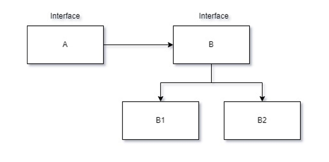

# 7.4 인터페이스 상속을 통한 안전한 기능 확장

때로는 서버가 운영 중인 상태에서 서버를 재시작하지 않고 긴급하게 애플리케이션이 사용중인 SQL을 변경해야 할 수도 있다.
만약 애플리케이션을 새로 시작하지 않고 특정 SQL의 내용만을 변경하고 싶다면 어떻게 해야할지 생각해보자.

## 7.4.1 DI 기능과 확장

### DI와 인터페이스 프로그래밍

DI를 적용할 때는 가능한 한 인터페이스를 사용하게 해야 한다.
인터페이스를 사용하는 이유는 여러가지가 있다.

- 다형성을 얻기 위해서다. 하나의 인터페이스를 통해 여러 개의 구현을 바꿔가면서 사용할 수 있게 하는 것이 DI가 추구하는 첫 번째 목적이다.
- 인터페이스 분리 원칙을 통해 클라이언트와 의존 오브젝트 사이의 관계를 명확하게 해줄 수 있기 때문이다.

B1 인터페이스를 B가 구현하고 있고, A는 B1 인터페이스를 통해서만 B를 사용한다면, 그래서 DI 받을 때도 B1 인터페이스를 통해 받는다면
A에게 B는 B1이라는 관심사를 구현한 임의의 오브젝트에 불과하다.
그래서 같은 B1 이라는 인터페이스를 구현했다면 B가 아니라 C, D 클래스로 만들어진 오브젝트이더라도 A에게 DI가 가능해진다.

그런데 B 오브젝트는 B1이 아니라 B2라는 다른 인터페이스를 구현하고 있을 수도 있다.
B2라는 인터페이스가 그려주는 창으로 B를 바라보는 다른 종류의 **클라이언트**가 존재하기 때문이다.

즉 인터페이스는 하나의 오브젝트가 여러 개를 구현할 수 있으므로, 하나의 오브젝트를 바라보는 창이 여러 가지일 수 있다는 뜻이다.

그러면 굳이 B2라는 인터페이스에 정의된 내용에는 아무런 관심 없는 A 오브젝트가 B2 인터페이스의 메서드까지 모두 노출되어 있는 B라는 클래스에
직접 의존할 이유가 없다. 게다가 B2에 변화가 발생하면 A에도 영향을 줄 수도 있다.
그래서 인터페이스를 클라이언트의 종류에 따라 적절하게 분리해서 오브젝트가 구현하게 하면 매우 유용하다.

오브젝트가 그 자체로 응집도가 높은 작은 단위로 설계됐더라도, 목적과 관심이 각기 다른 클라이언트가 있다면 인터페이스를 통해
이를 적절하게 분리해줄 필요가 있고, 이를 객체지향 설계 원칙에서는 **인터페이스 분리 원칙**이라고 부른다.

## 7.4.2 인터페이스 상속

인터페이스 분리 원칙이 주는 장점은 모든 클라이언트가 자신의 관심에 따른 접근 방식을 불필요한 간섭 없이 유지할 수 있다는 점이다.
그래서 기존 클라이언트에 영향을 주지 않은 채로 오브젝트의 기능을 확장하거나 수정할 수 있다.

SQL 변경을 하는 `UpdatableSqlRegistry`와 변경 요청을 담당하는 SQL 관리용 오브젝트가 있다고 가정한다.
SQL을 관리하는 역할을 하는 클래스 이름은 `SqlAdminService`이다.

DI 결과만 보자면 `BaseSqlService`와 `SqlAdminService` 오브젝트는 동일한 `MyUpdatableSqlRegistry` 오브젝트를 DI 받아서 사용한다.

오브젝트의 의존관계를 보자면 DI를 통해 동일한 오브젝트를 의존하고 있지만 설계와 코드에서는 각각 `SqlRegistry`와 `UpdatableSqlRegistry`
라는 인터페이스에 의존하고 있을 뿐이다.

`BaseSqlService`와 `SqlAdminService`는 동일한 오브젝트에 의존하고 있지만 각자의 관심과 필요에 따라 다른 인터페이스를 통해
접근한다. 이것은 인터페이스를 사용하는 DI이기 때문에 가능한 일이다.

