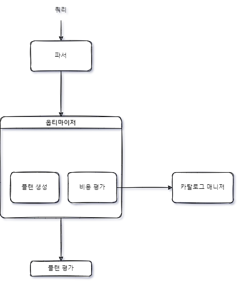

# 목차

- [목차](#목차)
- [2. DBMS와 실행 계획](#2-dbms와-실행-계획)
  - [2.1 권한 이양의 문제점](#21-권한-이양의-문제점)
  - [2.2 데이터에 접근하는 방법](#22-데이터에-접근하는-방법)
      - [파서](#파서)
      - [옵티마이저](#옵티마이저)
      - [카탈로그 매니저](#카탈로그-매니저)
      - [플랜 평가](#플랜-평가)
  - [2.3 옵티마이저와 통계 정보](#23-옵티마이저와-통계-정보)
  - [2.4 최적의 실행 계획을 작성하려면?](#24-최적의-실행-계획을-작성하려면)
  - [2.5 대표적인 DBMS의 통계 정보 갱신 명령어](#25-대표적인-dbms의-통계-정보-갱신-명령어)

# 2. DBMS와 실행 계획

- 일반적인 프로그래밍은 어디에 있는 데이터를 어떻게 찾고 처리할지 등의 세부사항을 개발자가 직접 결정한다.
- 하지만 SQL은 이런 절차적인 것은 전혀 기술하지 않고 사용한다.

## 2.1 권한 이양의 문제점

- 프로그래밍 언어(C, 자바 등..) 개발자가 데이터에 접근하기 위한 **절차(HOW)** 를 책임지고 기술해야 한다.
- 반면 RDB는 사용자가 하는 일은 **대상(WHAT)** 을 기술하는 것 뿐이다.

 Why?

그렇게 하는 것이 비즈니스 전체의 생산성을 향상시키기 때문이다.

하지만 내부적으로 자동화 된 절차 때문에 성능 이슈를 불러오는 경우도 있으므로, RDB의 내부 절차가 어떻게 동작하는 지 아는 것이 중요하다.

## 2.2 데이터에 접근하는 방법

- RDB에서 데이터에 접근 절차를 결정하는 모듈을 **쿼리 평가 엔진** 이라고 한다.
- 쿼리 평가 엔진은 SQL을 처음 읽어들이는 모듈이기도 하다.
- 쿼리 평가 엔진은 파서 또는 옵티마이저 같은 여러 개의 서브 모듈로 구성된다.

#### 파서

- 구문 분석 역할을 한다.
- 사용자가 입력한 SQL 구문이 항상 올바르진 않으므로 검사를 해준다.

#### 옵티마이저

- 파서를 통과한 쿼리가 도달하는 곳이다.
- 인덱스 유무, 데이터 분산 또는 편향 정도 등을 고려해 **실행 계획(plan)** 을 작성하고, 이들의 비용을 계산한다.
- 여러 비용 중에서 가장 낮은 비용을 가진 실행 계획을 선택한다.
- 접근법의 수가 많아지면 일일이 사람이 계산하기 힘들어지므로 RDB는 데이터 접근의 절차 지향 결정을 자동화한다.

#### 카탈로그 매니저

- 옵티마이저가 실행 계획을 세울 때 정보를 제공하는 역할을 한다.
- 카탈로그 내부에는 테이블 또는 통계 정보가 저장되어 있다.
- 이런 카탈로그 매니저를 _통계 정보_ 라고 부르기도 한다.

#### 플랜 평가

- 옵티마이저가 SQL 구문에서 여러 개의 실행 계획을 세운 뒤 그것을 받아 가장 최적의 실행 계획을 선택한다.
- 성능이 좋지 않은 SQL 구문이 있을 때 사용자가 직접 수정 방안을 고려할 수 있다.

## 2.3 옵티마이저와 통계 정보

데이터베이스 사용자는 옵티마이저와 통계 정보를 잘 다뤄야 한다. 플랜 선택을 옵티마이저에게만 맞기는 경우 최적의 플랜이 선택되지 않는 경우가 많다. 옵티마이저가 실패하는 패턴의 대표적인 예로 **통계 정보의 부족**이 대표적인 원인이다.

카탈로그에 포함된 통계 정보: 
  - 각 테이블의 레코드 수
  - 각 테이블의 필드 수와 필드의 크기
  - 필드의 카디널리티
  - 필드값의 히스토그램
  - 필드 내부에 있는 NULL 수
  - 인덱스 정보

문제가 생기는 경우는 카탈로그 정보가 테이블 또는 인덱스 정보와 일치하지 않을 때다.
테이블에 삽입/갱신/제거가 수행될 때 카탈로그 정보가 갱신되지 않으면, 옵티마이저는 오래된 정보를 바탕으로 실행 계획을 세운다

> 사용자가 테이블을 최초 생성했고 이에 따라 카탈로그 정보는 레코드 0개가 됐다고 가정한다.
> 이후에 1억 건의 데이터를 삽입하고 카탈로그 정보를 갱신하지 않으면 옵티마이저는 레코드 0개를 기준으로 
> 플랜을 생성한다. 당연히 이것은 최적의 플랜이 될 수 없다.

## 2.4 최적의 실행 계획을 작성하려면?

반드시 상황마다 올바른 통계 정보가 모여야 한다.

- 데이터를 크게 갱신하는 배치 처리가 있을 때는 Job Net을 조합하는 경우.
- Oracle 기본 설정에서 정기적인 통계 정보 갱신 작업 수행.
- Microsoft SQL Server에서 갱신 작업이 발생할 때마다 통계 정보도 자동으로 갱신.

통계 정보는 대상 테이블 또는 인덱스의 크기나 수에 따라 오랜 시간이 걸리므로 갱신 시점을 확실히 검토해야 한다.

## 2.5 대표적인 DBMS의 통계 정보 갱신 명령어

|이름|명령어|
|:--|:--|
|Oracle|exec DBMS_STATS.GATHER_TABLE_STATS(OWNNAME, TABNAME)|
|MySQL|ANALYZE TABLE [스키마 이름].[테이블 이름]
|PostgreSQL|ANALYZE [스키마 이름]_[테이블 이름]

