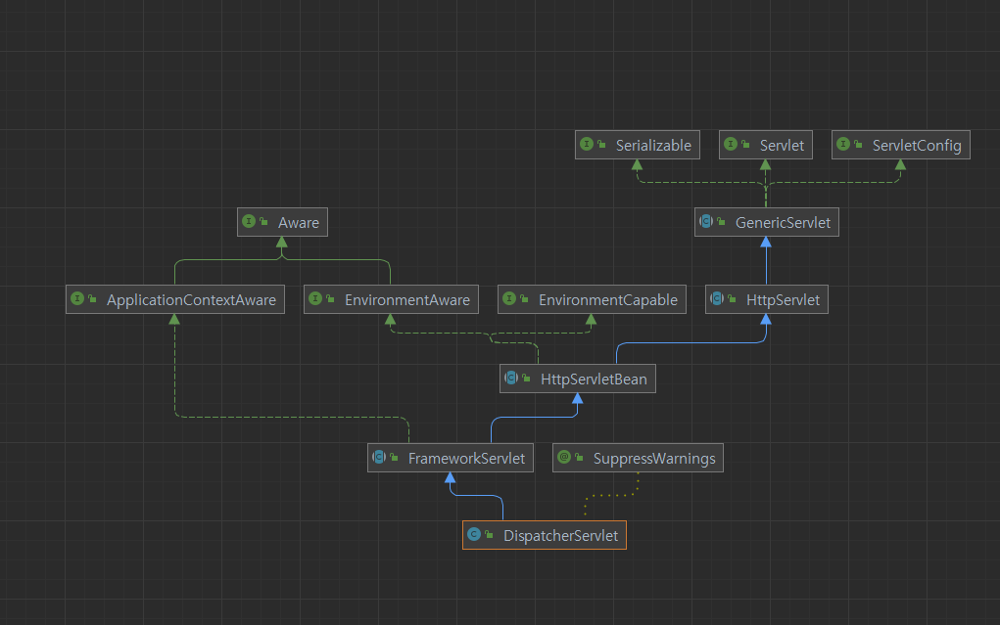

# 4.1 스프링 MVC 전체 구조


스프링 MVC도 프론트 컨트롤러 패턴으로 구현되어 있다. 스프링 MVC의 프론트 컨트롤러가 바로 **디스패처 서블릿**이다. 그리고 이 디스패처 서블릿이
스프링 MVC의 핵심이다.



그림을 보면 `DispatcherServlet`이 `HttpServlet`을 상속받는 것을 볼 수 있다. 따라서 서블릿 동작 방식과 동일하다.

### DispatcherServlet 요청 흐름

- 서블릿이 호출되면 `HttpServlet`이 제공하는 `service()` 가 실행된다.
- 스프링 MVC는 `DispatcherServlet`의 부모인 `FrameworkServlet`에서 `service()`메서드를 오버라이드 해뒀다.
- `FrameworkServlet.service()`를 시작으로 여러 메서드가 호출되면서 `DispatcherServlet.doDispatch()`가 호출된다.


- `FrameworkServlet.service()` 메서드
```java
/**
 * Override the parent class implementation in order to intercept PATCH requests.
 */
@Override
protected void service(HttpServletRequest request, HttpServletResponse response)
        throws ServletException, IOException {

    HttpMethod httpMethod = HttpMethod.resolve(request.getMethod());
    if (httpMethod == HttpMethod.PATCH || httpMethod == null) {
        processRequest(request, response);
    }
    else {
        super.service(request, response);
    }
}
```

스프링 MVC의 장점은 `DispatcherServlet`코드의 변경 없이, 원하는 기능을 변경하거나 확장할 수 있다는 점이다. 이 인터페이스들만 구현해서
`DispatcherServlet`에 등록하면 커스텀 컨트롤러를 만들 수도 있다. (사실 웹 애플리케이션을 만들 때 필요로 하는 대부분의 기능이 이미 다 구현
되어 있으므로 만들 일은 없다.)

- **주요 인터페이스 목록**
  - 핸들러 매핑
  - 핸들러 어댑터
  - 뷰 리졸버
  - 뷰