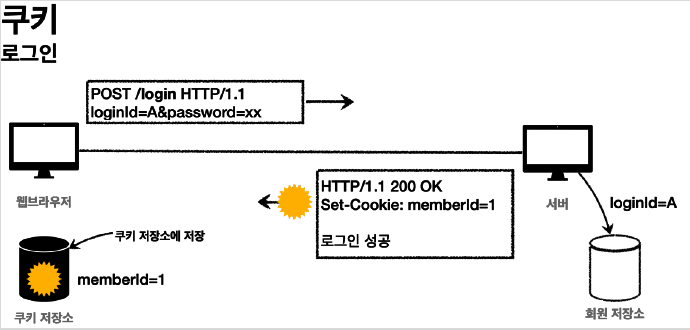
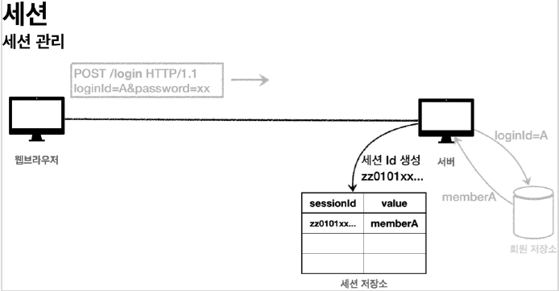
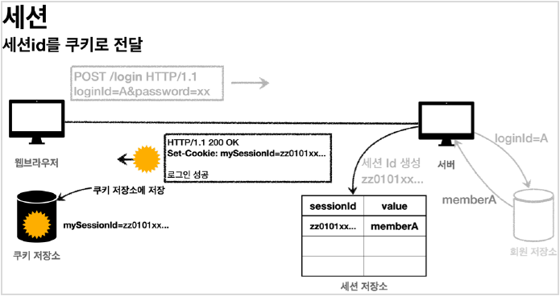
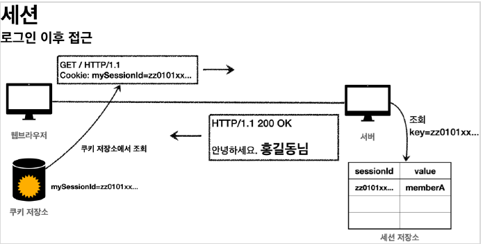

# 6.3 로그인 처리 - 쿠키 세션

HTTP 프로토콜은 기본적으로 무상태를 유지한다.
하지만 로그인은 사용자 정보를 유지해야 하므로 이것을 쿠키를 통해 구현한다.

- **쿠키 생성**



- **쿠키 사용**


## 6.3.1 예제

응답 객체 헤더에 쿠키를 담기 위해 핸들러 메서드 파라미터로 `HttpServletResponse`가 필요하다.
로그인 성공 처리 이후 해당 객체 아이디 값을 `addCookie()`로 담아서 전달한다.

- **LoginController**
  - response 헤더에 쿠키 객체를 저장한다.
  - POST 메서드가 실행될 때 `memberId`의 쿠키 값을 클라이언트로 전송한다.
```java
@PostMapping("/login")
public String login(@ModelAttribute("loginForm") LoginForm form, BindingResult bindingResult,
    HttpServletResponse response) {
    if (bindingResult.hasErrors()) {
        return "login/loginForm";
    }

    Member loginMember = loginService.login(form.getLoginId(), form.getPassword());

    if (loginMember == null) {
        bindingResult.reject("loginFail", "아이디 또는 비밀번호가 맞지 않습니다.");
        return "login/loginForm";
    }

    // 로그인 성공 처리, 세션 쿠키
    Cookie idCookie = new Cookie("memberId", String.valueOf(loginMember.getId()));
    response.addCookie(idCookie);
    return "redirect:/";
}
```

- **HomeController**
  - 로그인 성공 후 클라이언트는 본인이 가지고 있는 쿠키값을 서버에게 전송한다.
  - `findById()`에서 쿠키에 있는 `memberId`의 멤버 객체가 있다면 그 객체를 반환한다.
  - 멤버 객체를 모델에 담아서 타임리프 템플릿 뷰로 넘긴다.
```java
@Controller
@RequiredArgsConstructor
public class HomeController {

	private final MemberRepository memberRepository;

    @GetMapping("/")
    public String homeLogin(@CookieValue(name = "memberId", required = false) Long memberId, Model model){
		if (memberId == null) {
			return "home";
		}

		//로그인
		Member loginMember = memberRepository.findById(memberId);
		if(loginMember == null){
			return "home";
		}

		model.addAttribute("member", loginMember);
		return "loginHome";
	}
}
```

## 6.3.2 쿠키와 보안 문제

**6.3.2 예제**는 심각한 보안 결함이 있다.
쿠키는 클라이언트에 저장되는 값이기 때문에 예상가능한 값을 저장하면 다음과 같은 문제가 발생한다.

- 클라이언트에서 쿠키를 강제로 변경하면 다른 사용자가 된다.
- 쿠키에 보관된 정보는 훔쳐갈 수 있다.
- 해커가 쿠키를 한 번 훔쳐가면 평생 사용할 수 있다.

이런 보안 문제를 해결하려면 쿠키와 세션의 조합이 필요하다.

- **세션 생성**



- 사용자가 로그인 요청을 보내면 세션 ID를 생성하고 value에 값을 담는다.
- sessionId는 UUID로 생성되기 때문에 추정 불가능하다.

- **세션 ID를 응답 쿠키로 생성**



- 클라이언트와 서버는 결국 쿠키로 연결돼야 한다.
- 서버는 클라이언트에 `mySessionId`라는 이름으로 세션ID만 쿠키에 담아서 전달한다.
- 클라이언트는 쿠키 저장소에 `mySessionId`쿠키를 저장한다.

> **중요.**  
> 회원과 관련된 정보는 클라이언트에 바로 전송되지 않는다.  
> 오직 추정 불가능한 세션 ID만 쿠키를 통해 클라이언트에 전달한다.

- **클라이언트의 세션 ID 쿠키 전달**




- 클라이언트는 요청 시 항상 `mySessionId`를 전달한다.
- 서버에서는 클라이언트가 전달한 `mySessionId` 쿠키 정보로 세션 저장소를 조회해서 로그인시 보관한 세션 정보를 사용한다.

### 예제

- **loginController**

```java
@PostMapping("/login")
public String login(@ModelAttribute("loginForm") LoginForm form, BindingResult bindingResult,
    HttpServletRequest request) {
    if (bindingResult.hasErrors()) {
        return "login/loginForm";
    }

    Member loginMember = loginService.login(form.getLoginId(), form.getPassword());

    if (loginMember == null) {
        bindingResult.reject("loginFail", "아이디 또는 비밀번호가 맞지 않습니다.");
        return "login/loginForm";
    }

    // 로그인 성공 처리
    // 세션이 없으면 신규 세션 생성, 있으면 있는 세션 반환
    HttpSession session = request.getSession();
    // 세션에 로그인 회원 정보 보관
    session.setAttribute(SessionConst.LOGIN_MEMBER, loginMember);
    return "redirect:/";
}
```

- 로그아웃 시 신규 세션 생성은 필요없으므로 `getSession(false)`이 맞다.(디폴트 값은 true)

```java
@PostMapping("/logout")
public String logoutV3(HttpServletRequest request) {
    HttpSession session = request.getSession(false);
    if(session != null){
        session.invalidate();
    }
    return "redirect:/";
}
```

`HttpSession`을 이용해서 세션을 생성할 수 있다.  
로그인 요청 시 `request.getSession()`으로 신규 세션을 생성하고,
해당 세션에 `sessionId`와 값으로 넣을 객체를 담는다.

참고로 `SessionConst.LOGIN_MEMBER`는 상수값이다.

```java
public static final String LOGIN_MEMBER = "loginMember";
```

- **HomeController**
  - session에 담긴 값을 스프링은 `@SessionAttribute`로 불러올 수 있도록 지원한다.
  - 세션에 전달됐던 `SessionConst.LOGIN_MEMBER` 이름과 동일한 값을 찾아 `loginMember`에 넣는다.

```java
@GetMapping("/")
public String homeLoginV3Spring(
    @SessionAttribute(name = SessionConst.LOGIN_MEMBER, required = false) Member loginMember,
    Model model) {

    if (loginMember == null) {
        return "home";
    }

    model.addAttribute("member", loginMember);
    return "loginHome";
}
```

로그인 시 개발자 도구를 들어가면 응답 헤더에 `JSESSIONID`를 볼 수 있다.

```text
Set-Cookie: JSESSIONID=EF87984797D083C47E97C722C5FCA66A; Path=/; HttpOnly
```

## 6.3.3 세션 타임아웃 설정

세션은 사용자가 로그아웃을 누르면 `session.invalidation()`가 호출되는 경우 삭제된다.
문제는 대부분의 사용자는 웹 브라우저를 그냥 종료하지, 로그아웃 버튼을 누르는 경우는 거의 없다.
HTTP는 비연결성이므로 서버는 해당 사용자가 웹 브라우저를 종료한 것인지 아닌지 판단할 수 없다.

그렇다고 세션을 무한정 보관할 수도 없다. 왜냐하면,

- 세션을 무한정 보관하면 신규 사용자가 로그인할 때마다 서버 메모리가 낭비된다.
- 세션을 무한정 보관하면 탈취가 됐을 때 JSESSIONID로 사용자 정보를 공격자가 볼 수 있다.

### 세션의 종료 시점

세션의 종료 시점은 생성 시점으로부터 잡는 것은 좋지 않다.
한참 사용하다가 자동으로 30분 뒤에 로그아웃 되는 것은 사용성에도 좋지 않기 때문이다.
그렇기 때문에 생성 시점보다는 **사용자가 서버에 최근에 요청한 시간을 기준**으로 종료 시점을 잡아야 한다.

### 세션 타임아웃 설정

```properties
server.servlet.session.timeout=60
```

`application.properties`에서 세션 타임아웃을 지정할 수 있다.
설정 안했을 때의 디폴트 값은 1800이며 최소값은 60초다. 글로벌 설정은 **분 단위**로 해야한다.

만약 어떤 페이지에서만 세션 타임아웃을 변경하고 싶다면,

```java
session.setMaxInactiveInterval(1800); //1800초
```

를 사용한다.

- 세션을 사용할 때는 항상 최소한의 값만 저장해야 한다.
- 예를 들어, 위 예시에서는 세션 값으로 **객체**를 넣었지만 실무에서는 **객체 아이디 필드**와 같은 최소의 값만 저장해야 한다.
보관한 데이터 용량 * 사용자 수로 세션의 메모리 사용량이 늘어나면 장애로 이어질 수 있기 때문이다.
- 추가로 세션의 시간을 너무 길게 가져가도 메모리 낭비가 될 수 있으므로 적당한 시간을 선택해야 한다.